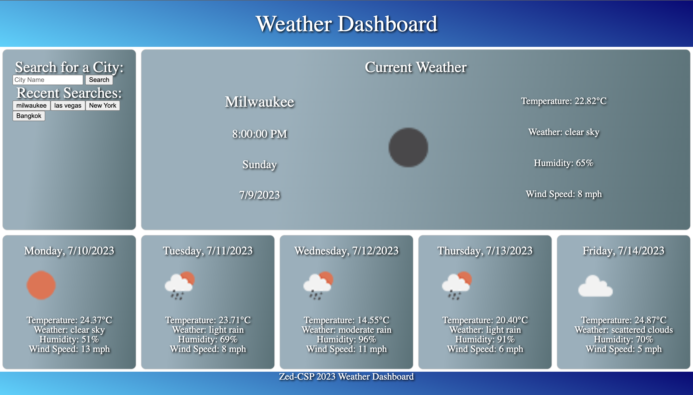

# Weather API dashboard

## Description
I built this Web-app to display my abilitiees to utilize and organize data from 3rd party API calls. The UI/UX was done with a combination of Grid and flex-box in vanilla CSS. The app also employs your browser's Local Storage to store and retrieve data. 

## Table of Contents
* [General Information](#general-information)
* [Preview](#preview)
* [Setup](#setup)
* [Usage](#usage)
* [Features](#features)
* [Technologies Used](#technologies-used)
* [User Story](#user-story)
* [Acceptance Criteria](#acceptance-criteria)
* [Credits](#credits)
* [License](#license)

## General Information
- The primary objective was to create a weather dashboard that the user can look up the current weather and 5 day forecast.
- Users have the ability to type in a city to view the current forecast, as well as to view and search from their search history.

## Preview


## Setup
The web application is readily available for use at [Weather-API-Dashboard](https://zed-csp.github.io/weather-API-Dashboard/). Also, feel free to pull the repo to run locally.

## Usage
- To view the current weather type your city into the search field on the left hand side.
- your past searches should appear in the left search bar for later reference

## Features
- Application loads with Users last search or default city
- Search current Weather as well as 5 day forecast 
- The application displays openweather's icons
- application converts m/s to mph and rounds to the nearest mph
- application converts raw json data to times, dates, and day of the week through built in javascript methods

## Technologies Used
- JavaScript
- HTML5
- CSS (both grid, and flexbox methods)
- Local storage
- APIs

## User Story
```md
AS A traveler
I WANT to see the weather outlook for multiple cities
SO THAT I can plan a trip accordingly
```

## Acceptance Criteria
```md
GIVEN a weather dashboard with form inputs
WHEN I search for a city
THEN I am presented with current and future conditions for that city and that city is added to the search history
WHEN I view current weather conditions for that city
THEN I am presented with the city name, the date, an icon representation of weather conditions, the temperature, the humidity, and the wind speed
WHEN I view future weather conditions for that city
THEN I am presented with a 5-day forecast that displays the date, an icon representation of weather conditions, the temperature, the wind speed, and the humidity
WHEN I click on a city in the search history
THEN I am again presented with current and future conditions for that city
```

## Credits
- Christopher Peret ([Zed-CSP](https://github.com/Zed-CSP))
- completed as a project for UC Berkeley extension class
